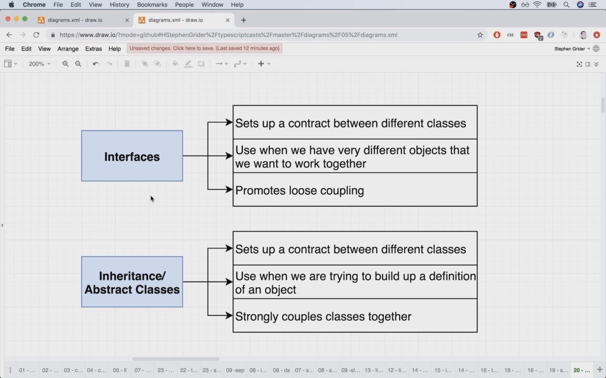
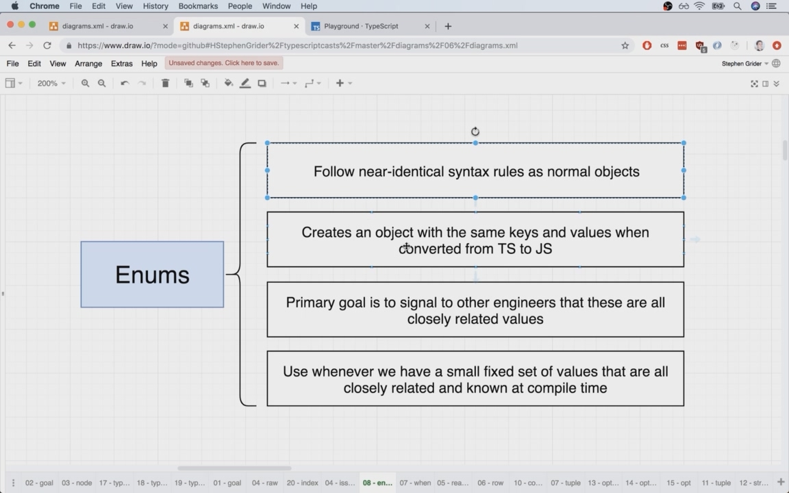
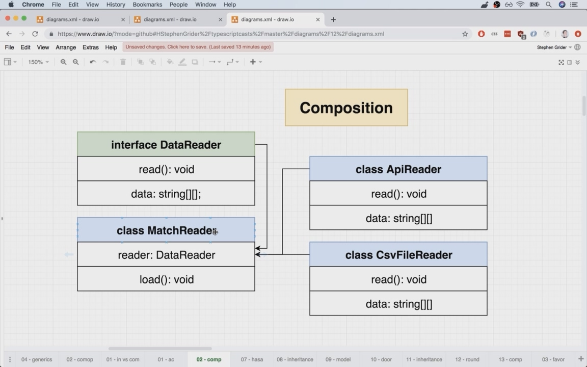

# Typescript: The Complete Developer's Guide

## Maps

- `export default`를 사용하지 않고 `export`만 사용하는 것이 TS best practice
- 불러온 library도 필요한 method들만 노출시킬 수 있음

  ```ts
  export class CustomMap {
    private googleMap: google.maps.Map;
  }
  ```

- 인자를 interface로 받는 것이 더 확장성 좋음

  ```ts
    addMarker(mappable: User | Company): void {
      //~~~
    }
    🔽
    addMarker(mappable: Mappable): void {
      //~~~
    }
  ```

- TS가 type checking하는 위치를 정확하게 하기 위해 (유지보수를 위해) `implements`를 사용하자

  ```ts
  export class User implements Mappable {
    //~~~
  }
  ```

## Sort

- nodeJS에서 TS 개발환경 세팅하기

  ```json
  "scripts": {
      "start:build": "tsc -w",
      "start:run": "nodemon build/index.js",
      // npm.scripts에서 "start:"로 시작하는 script들을 모두 실행
      "start": "concurrently npm:start:*"
    },
  ```

- class member 초기화를 간단히 나타하기

  ```ts
  class Sorter {
    collection: number[];
    constructor(collection: number[]) {
      this.collection = collection;
    }
  }
  ⏸
  class Sorter {  
    constructor(public collection: number[]) {}
  }
  ```

- array의 length 세련되게 가져오기

  ```ts
    const { length } = this.collection;
  ```

- string을 number처럼 정렬할 수 없는 이유
  - string은 number처럼 `string[0] = 'a'`로 기존 char를 교체할 수 없음

    ```ts
      const numbers = [1,2,3]
      numbers[0] = 10
      console.log(numbers) // [10, 2, 3]

      const string = 'red'
      string[0] = 'l'
      console.log(string) // 'red'
    ```

  - character들은 character code순으로 정렬되므로 알파벳순으로 정렬 안됨

    ```ts
      "X" > "a" // false
      "X".charCodeAt(0) // 88
      "a".charCodeAt(0) // 97
      // https://developer.mozilla.org/en-US/docs/Web/JavaScript/Reference/Global_Objects/String/charCodeAt
    ```

- 범용성있게 refactoring하기
  - before

    ```ts
    export class Sorter {
      constructor(public collection: number[] | string | LinkedList) {}

      sort(): void {   
        if(this.collection instanceof LinkedList) {
          // ~~~
        }

        if(this.collection instanceof Array) {
          if (this.collection[j] > this.collection[j + 1]) {
            const leftHand = this.collection[j];
            this.collection[j] = this.collection[j + 1];
            this.collection[j + 1] = leftHand;
          }
        }
        
        if(typeof this.collection === 'string') {
          // ~~~
        }
      }
    }

    const numbers = new NumbersCollection([10000, 3, -5, 0]);
    const numbersSorter = new Sorter(numbers)
    numbersSorter.sort();  
    ```

  - after

    ```ts
    export abstract class Sorter {
      sort(): void {
        // ~~~
      }
    }

    export class NumbersCollection extends Sorter {
      constructor(public data: number[]) {
        super();
      }

      // ~~~
    }

    export class CharactersCollection extends Sorter {
      constructor(public data: string) {
        super();
      }

      // ~~~
    }

    export class LinkedList extends Sorter {
      // ~~~
    }

    const numbers = new NumbersCollection([10000, 3, -5, 0]);
    numbers.sort();
    ```

- 부모 class에서 자신이 가지고 있지 않은 자식 class의 member를 사용하는 경우
  - `abstract`를 사용하여 자식 class에서 나중에 해당 member가 제공될 것을 약속함

  ```ts
  export abstract class Sorter {
    abstract compare(leftIndex: number, rightIndex: number): boolean;
    abstract swap(leftIndex: number, rightIndex: number): void;
    abstract length: number;

    sort(): void {
      const { length } = this;

      for (let i = 0; i < length; i++) {
        for (let j = 0; j < length - i - 1; j++) {
          if (this.compare(j, j + 1)) {
            this.swap(j, j + 1);
          }
        }
      }
    }
  }
  ```

- Interfaces VS Abstract Classes


## Stats

- nodeJS standard lib를 사용할 때도 type definition file 필요 -> `@types/node`

- `enum` 사용하기
  - 목록이 한정되어 있고(변하지 않고) 너무 많지 않은 경우 사용

  ```ts
    match[5] === 'H'
    match[5] === 'A'

    🔽

    const HomeWin = 'H'
    const AwayWin = 'A'
    const Draw = 'D'
    match[5] === HomeWin
    match[5] === AwayWin

    🔽
    
    const MatchResult = {
      HomeWin: 'H'
      AwayWin: 'A'
      Draw: 'D'
    }
    match[5] === MatchResult.HomeWin
    match[5] === MatchResult.AwayWin

    🔽

    enum MatchResult {
      HomeWin = 'H'
      AwayWin = 'A'
      Draw = 'D'
    }
    match[5] === MatchResult.HomeWin
    match[5] === MatchResult.AwayWin
  ```

  

  > *Favor object composition over class inheritance*
  >
  > Design Patterns, page 20
  >
  > object composition은 여러 object를 합쳐서(copy-and-paste) 하나의 object를 만드는 multiple inheritance를 의미하는 것이 아님

- Composition: **has a** relationship between two classes
  - cf) Inheritance: **is a** relationship between two classes
  - 같은 종류의 다른 class로 쉽게 교체 가능한 class의 일부분
  
<https://stackoverflow.com/questions/27572886/how-is-composition-different-than-multiple-inheritance>

### Generic Constraints

- Generic 사용시 일부 충족해야하는 property나 method가 Generic에 포함되어야 한다면 `extends`로 `interface`를 추가해야 함

  ```ts
  class Car {
    print() {
      console.log('I am a car');
    }
  }
  class House {
    print() {
      console.log('I am a house');
    }
  }

  function printHousesOrCars<T>(arr: T[]): void {
    for (let i = 0; i < arr.length; i++) {
      // Error: Property 'print' does not exist on type.
      // T에 print()가 없을 수도 있으니 허용하지 않음
      arr[i].print()
    }
  }

  interface Printable {
    print(): void 
  }

  function printHousesOrCars<T extends Printable>(arr: T[]): void {
    for (let i = 0; i < arr.length; i++) {
      // Error: Property 'print' does not exist on type.
      arr[i].print()
    }
  }
  ```

## Web Framework

- object를 통째로 받아 set하는 방법

  ```ts
    set(update: UserProps): void {
      Object.assign(this.data, update);
    }
  ```

- argument로 받는 object의 key에 따라 return type을 정하는 방법

  ```ts
    get<K extends keyof T>(key: K): T[K] {
      return this.data[key];
    }
  ```
